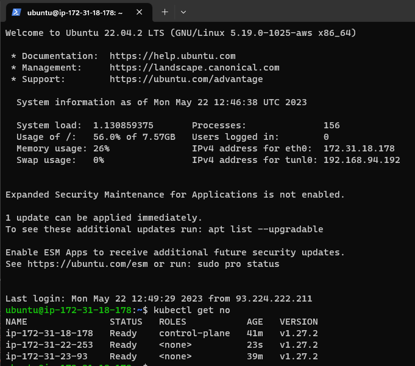

# Configure a multi-node K8S-Cluster
I always searched for an easy way to setup a vanilla K8s cluster on VM's.  
Since I didn't find anything comparable (without 10000 vars and stuff) i made this.  

**Tested with k8s version 1.28**  

**Tested on Ubuntu 22.04**



You can easily add new nodes to the inventory and just re-run it.  

## Needed tools
AWSCLI, Ansible, Terraform.  
I used WSL2 for installing them.

### Setup Environment
Install the official AWS CLI.  
```
curl "https://awscli.amazonaws.com/awscli-exe-linux-x86_64.zip" -o "awscliv2.zip"
unzip awscliv2.zip
sudo ./aws/install
```
Run configuration of your Environment
```aws configure```

## Setup Ansible
Im using ***ansible.cfg*** in my Environment, so set the ENV:  
```export ANSIBLE_CONFIG=./ansible.cfg```  

Also make sure you configured the SSH-Keys for your instances and Ansible.

## Run
Configure the remote backend 
```
cd infra/remote-state
terraform init && terraform apply -auto-approve
```
OR  
run locally if state is no concern for you.  

***Set the variables in ```variables.tf``` as needed***.

Spawn the infra:
```
cd infra
terraform init && terraform apply -auto-approve
``` 
This will populate your ansible inventory via a Templatefile so you dont have to take care of it.  
Then simply execute the playbook: 
```
cd config
ansible-playbook playbooks/setup-k8s-cluster.yml
```

## CI/CD
**Needs remote-state**  
The CI/CD Workflow will automatically update your infrastructure and run the defined playbook against it on Push to master.  
It will also comment your pull request with the output from the Terraform plan command to see possible changes.  
***Make sure the configure the needed secrets in GitHub***.